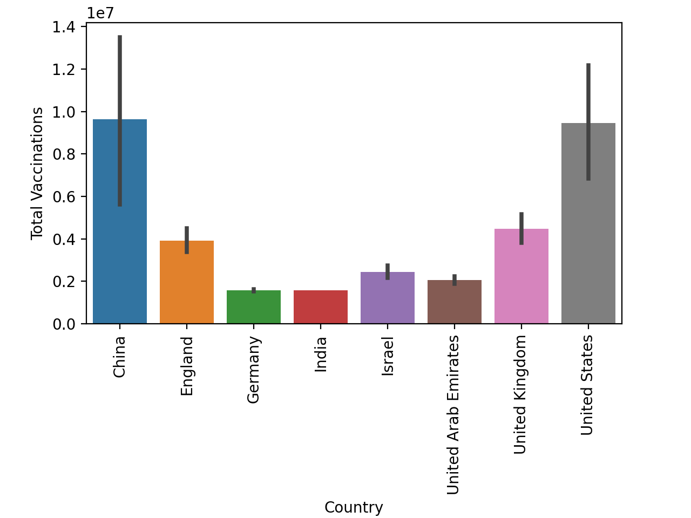
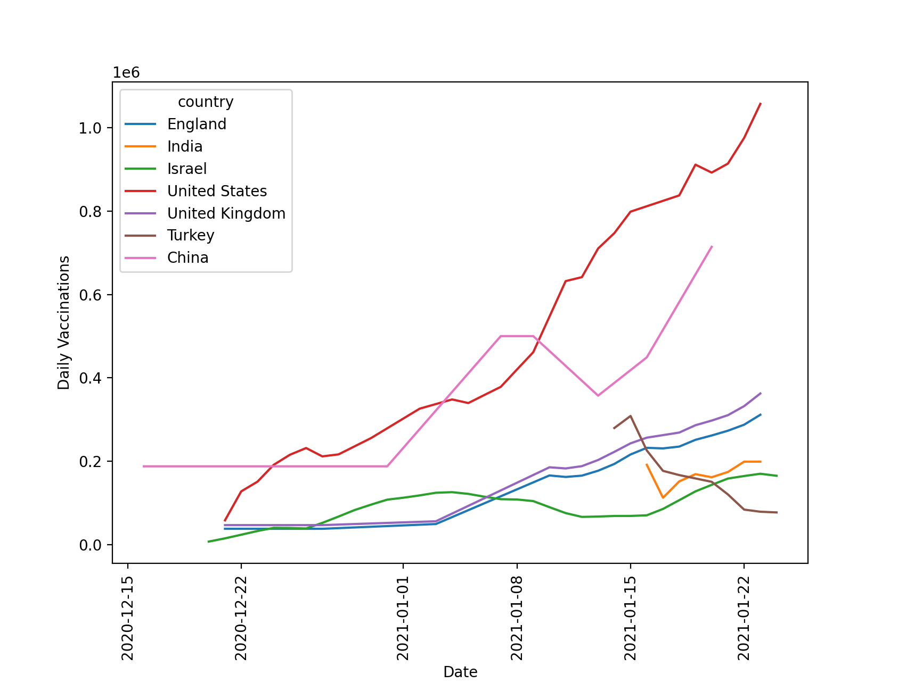
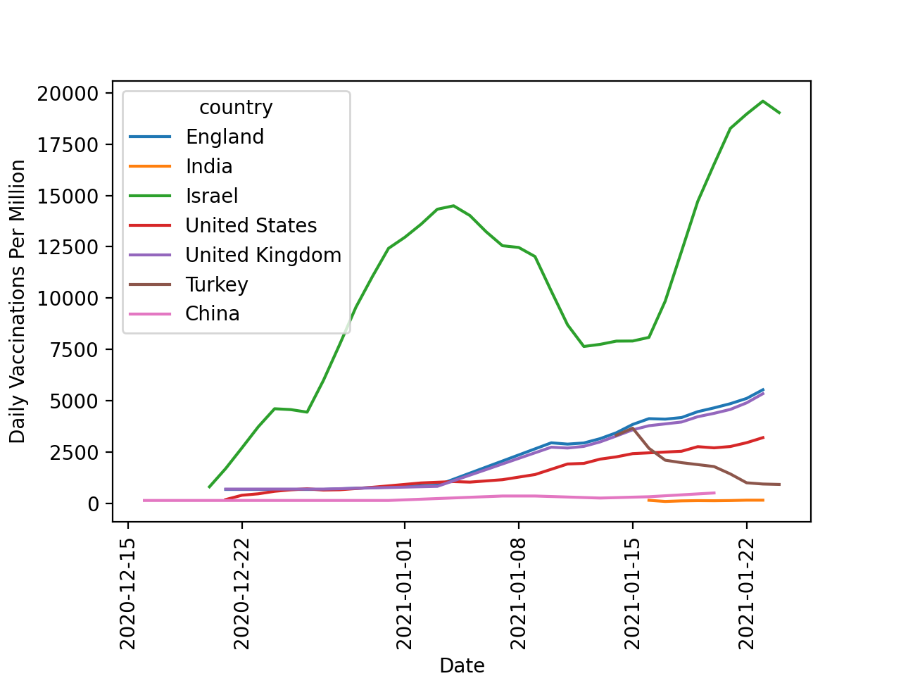

--- 
#indicate Frontmatter
layout: post
title: Descriptive Lab
---

# Which dataset did you work with?

I analyzed the **Covid-19 Vaccinations** dataset 

 

# Dataset Analysis Discussion
*I created two different graphs using panda and seaborn to compare the countries with the most daily vaccinations to those with the most daily vaccinations per million (people in the country).*

To determine the countries I would analyze for the highest daily vaccinations, I made a bar graph that would only show countries that had a total vaccination over a 1,500,000. From here, it was easy to determine the countries that had the highest total vaccinations. I chose seven  to analyze for daily vaccinations. ***Below is the bar graph used:***

*This bar graph clearly shows the countries that have the highest number of total vaccinations*

 

## Daily Vaccinations Graph Discussion

- **Variables and axis:** The variables studied for this graph were the daily vaccination numbers, different countries from the data set, and different dates. The Y-axis represents the daily vaccination number scaled to 1x10⁶, and on the X-axis we have the date. Additionally, the lines are color coated to identify which line corresponds to which country.
- **Relationship between variables:** For all countries except Turkey, the variables in the graph have a direct relationship, for the most part as time goes on, the number of daily vaccinations increases. This symbolizes the increasing distribution of the vaccine for each country. 
- **Distribution & Variability:** From the graph we can analyze the range. It appears that all of the data for daily vaccinations lies between 0.0 and 1.11x10⁶. The spread of the data is also clear, indicating that the United States has the most daily vaccinations on January 22, 2021, while Turkey has the least. Other than Turkey and India, all of the countries experienced their lowest daily vaccinations between December 15 and December 22 of 2020. The distribution of this line graph upholds what we see in the bar graph above, where United States, China, and the UK hold the highest total vaccinations and daily vaccinations. Lastly, from the line graph, we learn roughly when countries began to vaccinate. India and Turkey began vaccinations far later than other countries, only portraying data after January 15, 2021.
- **What conclusions can you draw about this dataset:** In short, while there are fluctuations in the number of daily vaccinations, the line of best fit for all of the countries, other than Turkey, is positive, indicating that as time increases, countries are increasing the efficiency of their covid-19 vaccinations. This line graph prompts us to ask ourselves what is causing the dramatic decrease in the vaccinations for Turkey? Perhaps Turkey's distribution process for the vaccine may not be very effective, or they have vaccinated the majority of their citizens already.

 

## Daily Vaccinations Graph Discussion

- **Variables and axis:** The varaibles and axis' for this second line graph are the same as the one above, the only difference is the Y-axis. On this line graph the Y-axis represents Daily Vaccinations Per Million. 
- **Major Difference** When trying to understand a country's vaccination distribution efficiency it is key to analyze various graphs and datasets. The two line graphs in this post are a perfect illustration of why this is necessary. The "per million" graph scales the information from the first line graph, showing the percent of the county's citizens that are vaccinated. If we only studied the first graph, the person reviewing the graphs would assume that the United States and China have vaccinated the most of its citizens compared to the other countries. However, the United States and China also have larger populations than the other countries analyzed. From this graph, it is clear that at its peak, Israel has vaccinated roughly 20,000 out of every 1 million citizens daily, while all other countries have vaccinated no more than 5,000 daily. Additionally, from this graph, we see a similar trend as the first line graph, where Turkey's daily vaccinations per million are decreasing fairly rapidly. In short, while the U.S. may have more infrastructure for distributing the Covid-19 vaccine, and thus vaccinated a greater number of citizens, Israel has a far higher percentage of its country's citizens vaccinated.   

## Callaboration and Credit
I worked with Ethan and Logan on this lab, however my entire blog post is my own work!

 

### Written, Edited, Created, Thought of, and Programmed by: 
Lucca Correia (HM '22)  